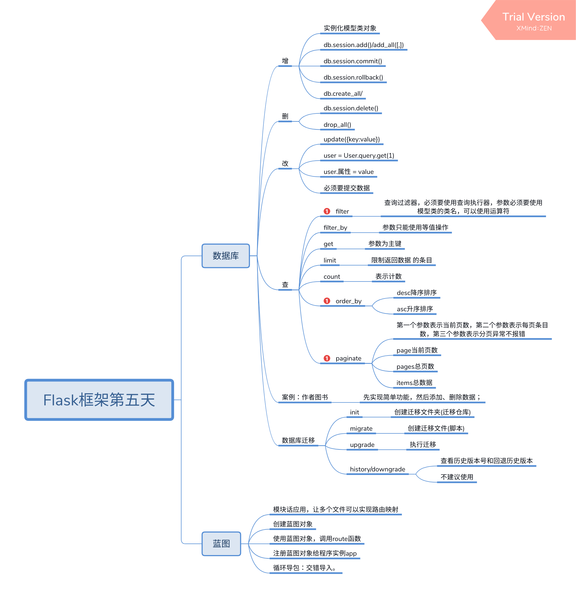

## WTF 表单
include不可以复用WTF实现的表单, WTF定义在python文件中(include作用只在模板中)

表不是使用create_all创建的，而是使用迁移创建的

use python in terminal is use 缓存

## 路由映射为什么使用列表，不适用字典
字典key唯一, 有一个url请求不同，对应多个页面;
路由映射一般不大

## 异常处理,
数据库修改表的操作都需要使用异常处理

database    CURD

##
一般没有创建库删除库  ->　都是使用迁移实现

道生一，一生二，二生三，三生万物

# Flask框架第五天
## 数据库
### 增
* 实例化模型类对象
* db.session.add()/add_all([,])
* db.session.commit()
* db.session.rollback()
* db.create_all/
### 删
* db.session.delete()
* drop_all()
### 改
* update({key:value})
* user = User.query.get(1)
* user.属性 = value
* 必须要提交数据
### 查
* filter
    * 查询过滤器，必须要使用查询执行器，参数必须要使用模型类的类名，可以使用运算符
* filter_by
    * 参数只能使用等值操作
* get
    * 参数为主键
* limit
    * 限制返回数据 的条目
* count
    * 表示计数
* order_by
    * desc降序排序
    * asc升序排序
* paginate
    * 第一个参数表示当前页数，第二个参数表示每页条目数，第三个参数表示分页异常不报错
    * page当前页数
    * pages总页数
    * items总数据
### 案例：作者图书
* 先实现简单功能，然后添加、删除数据；
### 数据库迁移
* init
    * 创建迁移文件夹(迁移仓库)
* migrate
    * 创建迁移文件(脚本)
* upgrade
    * 执行迁移
* history/downgrade
    * 查看历史版本号和回退历史版本
    * 不建议使用
## 蓝图
### 模块话应用，让多个文件可以实现路由映射
### 创建蓝图对象
### 使用蓝图对象，调用route函数
### 注册蓝图对象给程序实例app
### 循环导包：交错导入。

